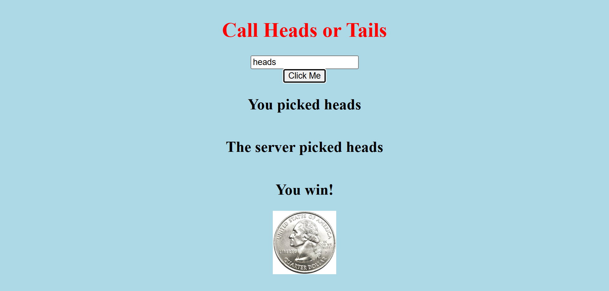

# Server Side Coin Flip App

Link to project: (https://nodecoinflipgame.onrender.com/)

## How It's Made:
Tech used: HTML, CSS, JS, Node.js

A simple server side application that allows a user to play against the server. If the user enters heads or tails, the server will randomly pick heads or tails. If the user and server choices match, the user wins!

## Optimizations

## Lessons Learned

